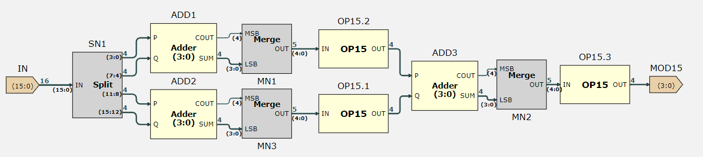

# Challenge: 16x16 Multiplier

Created: March 16, 2025 4:22 PM
Class: Spring

# Introduction

In this challenge, my task is to design a 16x16 multiplier with the following constraints:

- Use no more than 64 Full Adders(FA) in total

and the following goals:

- Use at least hardware as possible measured in FA
- Complete the multiplication process in least cycles as possible

My solution uses 58 FAs and completes the process in 2 cycles.

# Algorithm

I converted binary number system to Residue Number System(RNS), where each number is expressed as residue(remainder when divided by a modulus) of a set of modulus. The system works because the proof of Chinese Remainder Theorem. I will use notations:

- $x$ and $y$ to represent the multiply operands
- $a$, $b$ and $c$ to represent the moduli
- $n$ for the quotient of $x\cdot y$ divided by 4080, $r$ for its remainder

Hence, $x\cdot y = 4080n + r$.

## Chinese Remainder Theorem

### The Simplified Theorem

The Chinese Remainder Theorem states that, if:

$$
x \equiv r_a \pmod a \\ x \equiv r_b \pmod b \\ x \equiv r_c \pmod c \\ gcd(a,b,c) = 1
$$

then there exists an unique solution of  $x \equiv r_{abc} \pmod {abc}$, or in other words,

$$
\text{It's always possible to express} \hspace{0.25em} x=n\cdot abc + r\hspace{0.25em} \text{if:}\\
x \bmod{a},\hspace{0.25em} x\bmod{b},  \hspace{0.25em} \text{and} \hspace{0.25em}x\bmod{c}, \\

{\text{are known, and}\hspace{0.5em}  0 \le x < abc}.

$$

### Solution

For each modulus $m_i$, we need the value of:

$$
\large{c_i\cdot M_i\cdot y_i}
$$

where:

$c_i$: the residue of this modulus

$M_i$: the product of the other two moduli

$y_i$: the multiplicative inverse, which satisfies the relationship $M_i\cdot y_i \equiv 1 \pmod{m_i}$.

And the unique solution is

$$
r= \sum_{i} c_i\cdot M_i\cdot y_i  
$$

## Implementing Chinese Remainder Theorem

I introduced three stages in order to implement the Chinese Remainder Theorem:

1. Converting from binary number system into RNS
2. Carry out multiplication using simpler logic in RNS
3. Convert from RNS to binary number system for final results

I chose 15,16 and 17 as moduli because they are easy to bit manipulate.

### Converting BNS to RNS

To convert to RNS, I need to find residues of all three moduli(15, 16, 17) for both x and y, but the logic is the same. I will apply the same logic using twice the components.

- $\bmod 15$
    
    Note:
    
    $$
    16k = 15k + k \iff 16k \equiv k \pmod{15} \\ 1,0000\cdot k = 1111\cdot k + k \iff 1,0000\cdot k \equiv k \pmod{15} \\[5pt]
    \text{Since a 16-bit number can be expressed as:} \\
    \underbrace{1100}_{C_3}\hspace{0.25em} \underbrace{1010}_{C_2}\hspace{0.25em} \underbrace{0111}_{C_1} \hspace{0.25em}\underbrace{0000}_{C_0} \\[10pt]
     x = C_3\cdot 2^{12} + C_2\cdot 2^{8} + C_1\cdot 2^{4} + C_0 \\ x \equiv (C_3 +C_2 +C_1+C_0) \pmod{15}
    $$
    
    where $C_i$ are 4-bit numbers. Hence to find mod 15 of a 16-bit number, I would only need to add 4 4-bits numbers up which can be achieved by 9 FA, 3 HA and some combinational logic.
    
    
    
    The block OP15 implements some simple combinational logic that finds MOD15 from a 5-bit number.
    
    
    
    The logic implementation here achieves the effect of minus 15 if `IN ≥ 1111`. As a sum of two 4-bit numbers, 5-bit `IN` has a maximum value of  30 or`11110`. Hence, the range of `IN` when bit 4 is `1` is `[10000, 11110]`. All numbers between this range is larger than 15, the range of them minus 15 is `[00000, 01111]`, so I could discard bit 4 in the result since it would be `0` in any situation. The select line of the multiplexer(MUX2) is only `1` if `IN` is in the range `[01111. 11110]`, which we do need to minus 15. Since the highest bit is discarded minus `1111` is equivalent to plus `0001` in two’s complement. Hence the effect of this block is: minus 15 if the result is not negative. Outputs 4 bits result that ranges from `[0000, 1110]`.
    
- $\bmod 16$
    
    Conveniently, the 4-bit LSB of every binary number is effectively their residue of mod 16. This is because minus 16 is equivalent to minus `0b1,0000` , where the last four bits are always unchanged. Hence, a bus selector that selects bits(3:0) would do the trick. This is combined with the sample logic that will be mentioned later.
    
- $\bmod 17$
    
    **THIS PART IS MODIFIED AFTER 9PM 3/16 TO CORRECT THE MISTAKE**
    
    Note:
    
    $$
    256k = 255k + k \iff 255k \equiv k \pmod{17} \\
    \text{Hence, }2^8\cdot k \equiv k \pmod{17} \\[5pt]
    \text{Similar to mod 15, express:} \\
    \underbrace{11001010}_{C_1}\hspace{0.25em} \underbrace{01110000}_{C_0}\\[10pt]
    x = C_1\cdot 2^8 + C_0\\
    x \equiv (C_1 +C_0) \pmod{17}
    $$
    
    After splitting up into smaller 8-bit chunks, more simplifying is possible:
    
    $$
    x = 16C_1 + C_0 \\
    x \bmod 17 = 17C_1 - C_1 + C_0 = C_0 - C_1 \\[2pt]
    \text{Since } \overline{C_1} = 15- C_1,\\[2pt]
    -C_1 = \overline{C_1} - 17 + 2 \\[2pt]
    x \bmod {17} = C_0 + \overline{C_1} - 17 + 2\\[2pt]
    x \bmod {17} = C_0 + \overline{C_1} + 2
    $$
    
    Hence mod 17 can be broken down into 2 stages; first is finding mod 17 of two separate 8-bit number, second is combine them. This would need to use 11 FA and 1 HA.
    
    Stage 1:
    
    
    
    Stage 2: `OP17.IN` is connected to `Merge.OUT`. Essentially the outputs from OP17 are MOD 17 of separate 8-bit chunks, and I need to sum them up, also applying combinational logic.
    
    
    
    I will adapt to the notation A and B for outputs from the two parallel OP17 for now, where A is the output from the one above. Note A and B have the range of [0, 16] (OP17 explained below). I separated the calculation of bit 4 and bits (3:0). As my combinational logic connection here, bit 4 is:
    
    $$
    OUT(4) = A(4)\oplus B(4) \cdot EQ1.Q  
    $$
    
    The first product $\small{ A(4)\oplus B(4)}$ represents checking if exactly one of A and B is 16, because MOD17(4) is only `1` if `MOD17 = 1,0000`. If so, bit 4 would only be `1` if  the other number is 0, because $\small {(16 +n) \equiv (n-1) \pmod{17}}$, and bits (3:0) of the other number would be just minus 1, as implemented by a multiplexer and a custom minus1 block. 
    
    In the case where both A(4) and B(4) are `0`, I simply summed them up and used OP17 to minus 17. The result will be combined with `0` as bit 4, from logic derived above.
    
    **THIS PARAGRAPH IS ADDED AFTER DDL:**
    
    **I noticed a flaw in my original idea. When both A and B are 16, MOD 17 should be 15, but my logic can’t obtain the correct answer. I added a multiplexer to correct the problem.**
    
    **THIS PARAGRAPH ENDS HERE.**
    
    OP17 serves a similar use as OP15. The logic is similar as well.
    
    
    

### Finding Unique Solution

Now I have MOD15, MOD16 and MOD17, I can now work on multiplying those residues and find the combined residue, then process further to find the unique solution.

### Multiplying Residues

The following property is proven to be correct:

$$
\text{If } x\equiv r_x \pmod{a}\text{ and } y\equiv r_y \pmod{a}, \\
\text{then } xy\equiv r_xr_y\pmod{a}
$$

- MOD15
    
    I used Chinese Remainder Theorem again by using moduli 3 and 5.
    
    
    
    Where `COMBINE3` and `COMBINE5` are blocks with simple logic to find MOD3 and MOD5.
    
    COMBINE3:
    
    
    
    COMBINE5:
    
    
    
    `CMY35` and `CMY53` are used to find the $\small{c_i M_i y_i}$ terms.
    
    CMY35: $\small{M_3 y_3 = 10}$
    
    
    
    CMY53: $\small{M_5 y_5 = 6}$
    
    
    
    Then the results are added, to obtain a 6-bit number which will become the unique solution after MOD15. The 6-bit number has been bit manipulated just like MOD15 logic above; I extended bits (5:4) to bits(7:4), then add them to output a 5-bit number. If bit 4 is 1, then the number can be minus 15 again, which is equivalent to plus 1 in two’s complement; if bit 4 is 0 and bit (3:0) are not `1111`, then the number is kept unchanged.
    
    
    
    Finding MOD15 of $\small{x\cdot y}$ took 7FA and 2HA.
    
- MOD16
    
    Simple enough, finding MOD16 of the multiple is the same as above, multiply and select bits (3:0). This is very convenient which saves adders and will be explained later.
    
- MOD17
    
    There is no shortcut to MOD 17 so I used a 4-bit multiplier. 
    
    
    
    I still used bit manipulation for bit 4 to save adders. Since MOD 17 could only be less or equal to `1,0000`, I picked out the scenarios where one does equal to 16.
    
    When both are 16, use result $\small{256\equiv 1 \pmod{17}}$. Hence I used a constant `1`.
    
    When one of them are 16, I multiplied the other by 16 by appending 4 `0` at the end of it(LSL 4). 
    
    When none are 16, I multiplied them using a 4-bit multiplier that is implemented by 8 FA and 4HA. 
    
    Then the multiplexer selects the correct output which is processed by a MOD 17 block. In total, I have used 19FA and 5HA.
    

### MOD 4080

I calculated necessary results:

- $\small{abc}$: $\small{15\times 16\times 17 = 4080}$ = `0b1111,1111,0000`
- $\small{y_i}$: $\hspace{0.25em} \small{y_{15}  = 8,\hspace{0.5em} y_{16} = 15,\hspace{0.5em} y_{17} = 9}$
- $\small{M_i\cdot y_i}$: $\hspace{0.25em} \small{M_{15}\cdot y_{15}  = 2176,\hspace{0.5em} y_{16} = 3825,\hspace{0.5em} y_{17} = 2160}$

| Moduli | $M_i$ | $y_i$ | $M_i\cdot y_i$ | $M_i\cdot y_i$ in Binary |
| --- | --- | --- | --- | --- |
| 15 | 272 | 8 | 2176 | **`0b1000,1000,0000`** |
| 16 | 255 | 15 | 3825 | **`0b1110,1111,0001`** |
| 17 | 240 | 9 | 2160 | **`0b1000,0111,0000`** |

Now, I would need to first find each $\small{c_iM_iy_i}$, sum them all up, then calculate the residue of MOD 4080. To implement $\small{c_iM_iy_i}$ blocks, I used no adders.

- $\small{c_{15}M_{15}y_{15}}$
    
    Since $\small{M_{15}y_{15} = }$ `0b1000,1000,0000`, and we are only multiplying by 4-bits, so there won’t be any carries generated, I did bitwise manipulation using 0 FA and 0 HA.
    
    
    
- $\small{c_{16}M_{16}y_{16}}$
    
    $\small{M_{16}y_{16} = }$ `0b1110,1111,0001`, bits (3:0) still has the ability to perform bit manipulation on because there will be no carries;
    
    For bits (7:4), I used a custom block NEGATE; where it performs `10000 - IN` and outputs bits(3:0) without using adders. Each increment in $\small{c_{16}}$ means bits (7:4) is plus `1111`, or, minus `1`; e.g. When $\small{c_{16}} =$ `0`, bits (7:4) = 0000; when it’s `1`, bits(7:4) = `1111`; when it’s `2`, bits (7:4) is `1110`. Hence it has the same effect as negating! Its carry will be explained in the next part;
    
    Bits(11:8) seems difficult at start but I quickly realized the same approach can be taken. Since each increment of  $\small{c_{16}}$ brings a carry from bits (7:4), it is equivalent to add `1111`, or minus `1`, which is the same as above! The only difference is I would need to minus `1` because in the first increment there is no carry, i.e. when $\small{c_{16}}$ = `1`, bits(7:4) = `1111` with no carry, so it need to minus `1`. It worked out perfectly because in the maximum case when $\small{c_{16} = 15}$, `OUT` = `1110,0000,0001,1111`, and bits(11:8) are exactly `0000` so no need to worry about carries and inconsistencies.
    
    For bits (15:12), I used a single minus `1` block that only minus `1` when it’s able to, i.e. It only minus `1` if input is larger than `0`.  Logic is the same as bits (11:8); the first increment doesn’t have a carry, but there is one for every others, so minus `1` would be enough. 
    
    
    
- $\small{c_{17}M_{17}y_{17}}$
    
    Again, 17 is the most difficult one to implement. $\small{M_{17}y_{17}} =$  `0b1000,0111,0000`.
    
    5-bits are difficult to deal with so I extracted bit 4 to be calculated on its own. The main logic only considers when input is less than 16:
    
    Bits (3:0) are `0000` as constant;
    
    This time instead of 4 bits, only bits (6:4) are negated for the exact reason as above; but this time it’s inconsistent because input is 4-bits but we are only negating 3 bits. This could caused inconsistencies in carries as once we moved on to increment `8`, bits (6:4) would move from `000` to `111`, which doesn’t generate a carry.
    
    The next four bits, bits(10:7), while within the consistency range, is minus `1` as normal; however, once it’s incremented for more or equal than `8`, then it need to be minus `2` because one carry is missed. Hence I chose bit 3 of input to be the select line of MUX2, which selects from minus `1` and minus `2`.
    
    Bits(14:11) are easy to deal with because there will be no carries from lower bits. 
    
    Bit(15) is constant `0`.
    
    Now to consider bit 5 of the input, I used two multiplexers to select from possible outputs. I included the faulty inconsistency as well.
    
    
    

Now the fragments has been collected; I need to sum those 3 16-bit numbers and find the solution. But that would require a lot of adders so I came up with a way that only requires 26 FA and 7 HA.

Using MOD4080 blocks that only requires 3 FA, I am able reduce each 16-bit output to 12-bit numbers; 

- MOD4080
    
    This is the design of MOD4080. Since $\small{4080_{10} = 1111,1111,0000_2}$, the nice number allows me to use minimum adders possible by taking advantage of $\small{4080 = 4096 - 16}$. 
    
    Bits(3:0) are unchanged;
    
    Assume output bits (15:12) are `0000` because after mod 4080 all bits higher than bit 11 will be 0, but input bits(15:12) will be useful.
    
    My idea behind the logic is to think it as cascading many single minus 4080 blocks. Each time it minus 4080, there are two possible occasions.
    
    1. Bits(15:12) minus 1; bits (11:4) plus 1. This is very easy to understand;
    2. Bits(15:12) unchanged, bits(11:4) plus 1. This only happens when bits (11:8) is equal to `1111`, and sum of bits(7:4) and bits(15:12) has carry.
    
    The sum from ADD1NEW1 will not produce a carry because the maximum of adder block ADD1 when it produces a carry is `1,1110`, so 4-bit LSB would never exceed `1110` when ADD1 is required hence no carry. I minus the result by 4080  right before the output to fix the case where input bits(11:4) is `1111,1111` because it doesn’t generate a carry.
    
    
    
- MINUS4080
    
    I used bit manipulation as above; this is not the optimal design and can be optimized using less blocks. 
    
    
    
- ADDx3
    
    I summed up 3 12-bit numbers using 14 FA and 2 HA. The logic is quite self-explanotary.
    
    
    

Now MOD 4080, which is $r$ has been found. Lastly I need to obtain $n$.

### Finding Final Product

The above solution, however only gives us the remainder $r$ . In order to find  $n$, I came up with the idea that I could use cascaded 4080 adders:

$$
\text{Since } xy = 4080n + r\\
xy = r + \underbrace{4080 + 4080 + \cdots + 4080}_{n} \\[5px]
$$

Adding one 4080 means adding 1111 to bits (7:4) without carries. Since $\small{65535 = 16\times 4080 + 255}$, that gives us 16 different possible arrays of bits(7:4), which is perfect because that means each number of bits(7,4)  in `[0000,1111]` will be linked to unique combination of $n$ and $r$. I will demonstrate using an example:

$$
\text{Product: 34157, } 34157 \bmod {4080} = 1517 \\
\text{Product: 1000,0101,0110,1101, mod 4080: 0101,1110,1101}
$$

The 4-bit LSB are the same as expected. Now, if I add 4080 one at one time:

$$
\text{Current sum: 0001,0101,1101,1101, 4080 added: 1} \\
\text{Current sum: 0010,0101,1100,1101, 4080 added: 2} \\
\text{Current sum: 0011,0101,1011,1101, 4080 added: 3} \\
\text{Current sum: 0010,0101,1100,1101, 4080 added: 4} \\
\text{Current sum: 0100,0101,1010,1101, 4080 added: 5} \\
\text{Current sum: 0101,0101,1001,1101, 4080 added: 6} \\
\text{Current sum: 0110,0101,1000,1101, 4080 added: 7} \\
\text{Current sum: 0111,0101,0111,1101, 4080 added: 8} \\
\text{Current sum: 1000,0101,0110,1101, 4080 added: 9} \\
$$

When bits (7:4) are equal, the sum became the correct product! This process could be optimized by using a 4-bit adder and a optimized multiply 4080 block.

I designed two separate logic for this section:

### Bits(7:4) Logic

I used 1 MULTx4 and 2 MULTx4LSB4 blocks, together with 6 FA and 2 HA to implement the logic to find bits(7:4) of $xy$. 

$$
\text{Consider two 16-bit numbers:}\\
x = C_3\cdot 2^{12} + C_2\cdot 2^{8} + C_1\cdot 2^{4} + C_0\\
y= D_3\cdot 2^{12} + D_2\cdot 2^{8} + D_1\cdot 2^{4} + D_0 \\ 
xy(7:4) = (C_0\cdot D_0)(7:4) + (C_1\cdot D_0)(3:0) + (C_0\cdot D_1)(3:0)
$$

And that is what this block is calculating. Conveniently, it also help us get mod 16 of $xy$ so a lot of adders are saved!

- MULTx4
    
    4x4 multiplier with 8 FA and 4 HA.
    
    
    
- MULTx4LSB4
    
    4x4 multiplier that only outputs 4-bit LSB. Uses 3 FA and 3 HA.
    
    
    

### Cascaded 4080 Adder Logic

There are three inputs that will enter the cascaded adders: 

1. `MOD4080`: same as $r$ above
2. `BENCHMARK`: $xy$(7:4)
3. `EN`: `1` if `MOD4080`(7:4) is not equal to `BENCHMARK`, else `0`

Each block has 2 outputs: `NEXTEN` and `OUT`. Together with `BENCHMARK`, they  provide the 3 required inputs for the next adder.

This is the design for `CASADD4080`. `NEXTEN` is decided based on whether or not the output is equal to benchmark; if so `NEXTEN` will be `0`, and the output will be the same as `IN` for the rest of `CASADD4080` blocks.

The plus logic comes from two’s complement:

$$
\overline{\overline{A} -B} = \overline{-A-1 +\overline{B} +1} = \overline{-A + \overline{B}} = -(-A+\overline{B}) -1 = -(-A-B-1)-1=A+B\\
$$

Hence, the final product is calculated!

# Implement MULT in EEP1

Since I could only use at most 64 adders, I need to split the process into 2 cycles to finish. In this section I would first explain my design, then machine code and modifications made to DPDECODE, ALU and REGFILE to implement the multiplication instruction.

## 2-stage Design

To have even amount of adders per cycle, and calculated the values with higher priority i.e. the ones that are required for next steps, I decided to have: Converting into RNS and parts of Finding Final Product in the first stage, and the rest in the second.

### Stage 1

This is the design for stage 1; I would need to use 2 registers and a new 4-bit register to store intermediate values, details will be explained later.

List of FA and other components:

| Component | Count | FA | HA |
| --- | --- | --- | --- |
| MOD15 | 2 | 18(9) | 6(3) |
| MOD17 | 2 | 22(11) | 2(1) |
| MULTx4 | 1 | 8 | 4 |
| MULTx4LSB4 | 1 | 3 | 3 |
| Others | 1 | 3 | 1 |
| TOTAL | 7 | 54 | 16 |

### Stage 2

The values from 3 registers has been fetch and processed. 

List of FA and other components:

| Component | Count | FA | HA |
| --- | --- | --- | --- |
| MULTRNS15 | 1 | 7 | 2 |
| CMY16 | 1 | 0 | 0 |
| MULTRNS17(MOD17) | 1 | 11 | 1 |
| MULTRNS17(MULTx4) | 1 | 8 | 4 |
| MULTRNS17:CMY17 | 1 | 0 | 0 |
| MULTRNS17:TOTAL | 1 | 19 | 5 |
| MOD4080 | 4 | 12(3) | 4(1) |
| ADDx3 | 1 | 14 | 3 |
| MULTx4LSB4 | 1 | 3 | 3 |
| Q4080 | 1 | 0 | 0 |
| Others | 1 | 3 | 1 |
| TOTAL | 11 | 58 | 18 |

### Error

I tried to combine the adders:

However, ISSIE reported a mistake that seems to be under development:

So I would have to implement two stages separately in EEP1.

## Machine Code

As mentioned previously, I would need to write 2 registers at the same time. This would require modifications in machine code structure; length of MOV instructions are not long enough for 4 addresses and MULT operational code. So I chose the unused `INS(15:12) = 111` code prefix as my MULT instruction operational code.

| 15 | 14 | 13 | 12 | 11 | 10 | 9 | 8 | 7 | 6 | 5 | 4 | 3 | 2 | 1 | 0 |
| --- | --- | --- | --- | --- | --- | --- | --- | --- | --- | --- | --- | --- | --- | --- | --- |
| 1 | 1 | 1 | 0 | a2 | a1 | a0 | d2 | b2 | b1 | b0 | c2 | c1 | c0 | d1 | d0 |
| 1 | 1 | 1 | 1 | a2 | a1 | a0 | X | b2 | b1 | b0 | c2 | c1 | c0 | X | X |

As a result, I would not be able to use assembler for assembly code; I would need to manually write machine code and use MOV instructions to assign values to registers first before multiplying because I didn’t include immediate operands.

`INS(15:13)`: `111`, to choose MULT instructions

`INS(12)`: MULTOPC, `0` means stage 1, `1` means stage 2

`INS(11:9)`: value of a, this is to be read

`INS(7:5)`: value of b, this is to be read

`INS(4:2)`: value of c, this is to be written for next Ra

`INS(8), INS(1:0)`: value of d, this is to be written for next Rb

## EEP1 Modification

I made several modifications to implement the MULT instructions:

### DPDECODE

I used a wire label `INS1` to extend `INS` input.

Firstly, I modified the logic for `AD1SELC` and `WEN1` in a similar manner:

Using an XOR gate so that if only one of the original and MULT conditions are satisfied, the output is `1`. Theoretically, an OR gate would have the same effect, but I think XOR gate is more precise.

Then I added some new output ports to DPDECODE. 

- `D`: register file address for Rd
- `MULTOPC`: `0` for stage 1, `1` for stage 2
- `WEN0`: `ENABLE` for the second write port, only `1` in MULT instruction stage 1(reserved for `D`)
- `MULTEN`: ENABLE in `ALU` for MULT instruction

### REGFILE

I changed the register file into 3 write ports, 3 read ports. One of read and write ports are reserved for REG8, a new register to store intermediate data in MULT instructions.

I simplified connection for one of the registers so it’s actually readable:

The use of 2-MUX and OR gate here allows 2 write ports to be independent from each other. Only two of registers will have EN high; and one will be written DIN0, the other DIN1.

I also added my custom register REG8 with a separate write/read and enable port.

### ALU

When `MULTEN` is `0`, MUX chooses from the normal ALU instructions that gets outputted to `ALU.OUT`; Note `OUT0` is only written by stage 1, which is consistent with logic I implemented in `DPDECODE` about `WEN0`. `OUT` flows to Rc, and `OUT0` flows to Rd. 

The final CPU schematic.

## Example

To demonstrate and test, I ran a simulation. Here is the contents in ROM:

In addresses 0x0000 and 0x0001 are `MOV R0, #47` and `MOV R1, #53`;

In addresses 0x0002 and 0x0003 are my custom MULT machine code:

`0x0002`: `1110, 0001, 0011, 1011`

`INS(15:13)` = `111`, MULT instruction code

`INS(12) = 0`, MULT stage 1

`INS(11:9)` = `000`, $x$ = R0

`INS(7:3)` = `001`, $y$ = R1

`INS(4:2)` = `110`, Write Port A = R6

`INS(8)`, `INS(2:0)` = `111`, Write Port B = R7

`0x0003`: `1111, 1100, 1111, 0000`

`INS(15:13)` = `111`, MULT instruction code

`INS(12) = 1`, MULT stage 2

`INS(11:9)` = `110`, Read Port A = R6

`INS(7:3)` = `111`, Read Port B = R7

`INS(4:2)` = `100`, Write Port = R4

`INS(8)`, `INS(2:0)` = `000`, Rd is don’t care

Works as expected.
